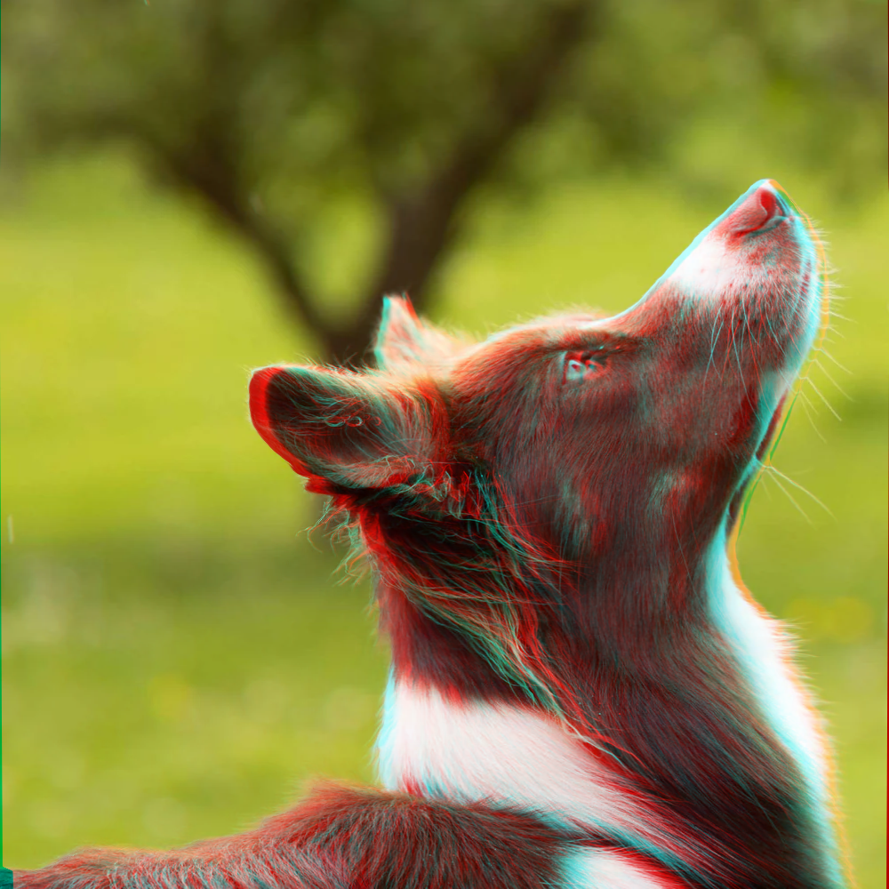

# anaglyph-tool
## CLI tool that turns images and videos into anaglyph (red-cyan) format using depth estimation model
It's not perfectly accurate but it does create a solid impression of 3d. The depth model is surprisingly temporally consistent.


The gif looks all messed up on preview for some reason


### Installation:
1. Clone this repo and install requirements.txt
2. Download a DepthAnythingV2 checkpoint you would like to use (larger takes longer to process) https://github.com/DepthAnything/Depth-Anything-V2?tab=readme-ov-file#pre-trained-models
3. Place the checkpoint inside anaglyph-tool/Depth-Anything-V2/checkpoints
4. Make sure you have ffmpeg in PATH

### Usage:
```
-i: Input path, video or image.
-m: Model checkpoint, vits for small, vitb for base and vitl for large.
-s: Scaling of red and cyan channel displacements. Higher values make scene seem smaller.
-f: Process only first f frames of the input video.
-o: Output file name.
```
Example:
```
python anaglyph_tool.py -i input_video.mp4 -f 200 -m vitb -s 30 -o output_video
```
Processes first 200 frames of input_video.mp4 using vitb model, scales channel shift by 30 and saves output as output_video.mp4

